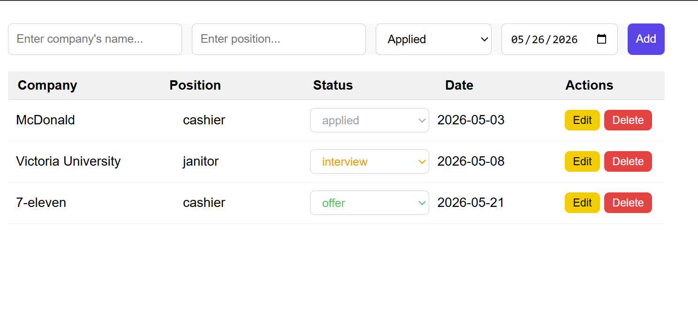
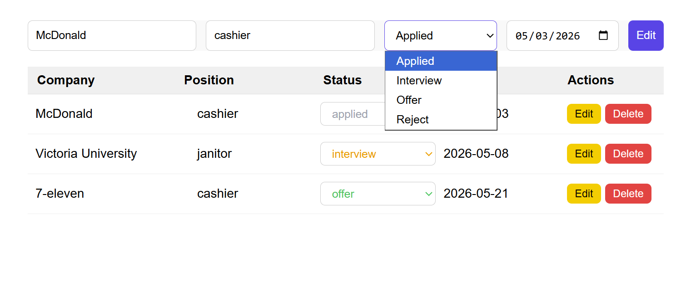

# Job Application Tracker

就職活動の応募状況を管理するためのReactアプリです。  
A React app for tracking job applications and application statuses.

---

## Features / 主な機能

- 求人応募の追加
- 応募一覧の表示
- 応募状況の編集
- 応募データの削除
- Local Storageによるデータ保存

- Add new job applications
- View application list
- Edit application status
- Delete applications
- Persist data using Local Storage

---

## Components / コンポーネント

- AppList
- AppForm
- AppItem

---

## Built With / 使用技術

- React
- JavaScript
- CSS
- Local Storage API

---

## What I Learned / 学んだこと

- Reactのコンポーネント設計
- PropsとStateの管理
- フォーム入力の処理
- `.map()`を使ったリスト表示
- Local Storageを使ったデータ保存
- CRUD機能の実装

- Component-based architecture
- Props and state management
- Form handling
- Rendering lists with `.map()`
- Persisting data with Local Storage
- Implementing CRUD features

---

## Future Improvements / 今後追加したい機能

- 検索・フィルター機能
- ログイン機能
- Spring Bootとの連携
- データベース対応

---

## Running Locally

### Prerequisites
- Node.js v18+
- npm

### Setup

1. Clone the repository

```bash
git clone "https://github.com/HanKwan/Job-application-tracker"
cd Job-application-tracker
```

2. Install dependencies

```bash
npm install
```

3. Start the development server

```bash
npm run dev
```

## Screenshot
## Home Page



## Editing



